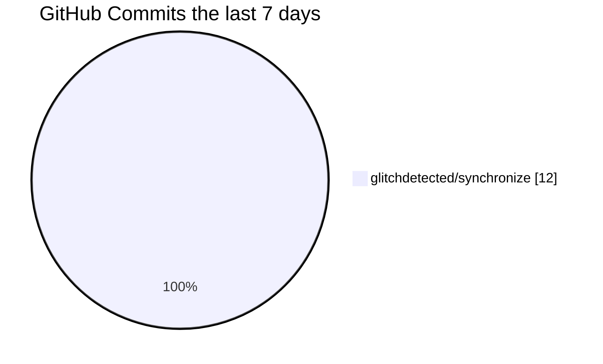

<!-- 

 -->
# 🗿 What's up, I'm GlitchDetected

**`Fullstack Developer`** *@ [RandomDevelopment](https://github.com/RandomDevTeam)*

What's up, my name is `GlitchDetected` and I love working with computers. I am passionate about programming and love utilizing different technologies/languages in my projects, mainly Typescript & PostgreSQL. I enjoy making a wide range of things, especially backend stuff.

       
      
      

## 🧰 Technologies
<a href="https://github.com/GlitchDetected" title="Click Me">
       
       
       
       
       
       
</a>

## Recent GitHub Activity

## ✏️ Projects
- [ChatGuard](https://discord.com/oauth2/authorize?client_id=1237878380838523001) - Discord chat bot to protect your discord server's chat from malicious spams, raids, users, and even bots.  

---